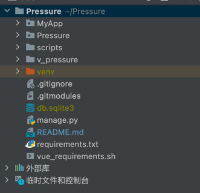

# Pressure

## 准备Python环境

- 安装Python>=3.10
- 安装依赖
    - pip3 install -r requirements.txt
- 安装vue环境
    - sh vue_requirements.sh

- 启动消息队列中间件
  ```
  python3 /Users/wangjie/Pressure/MyApp/task_mq.py
  注：想用几个并发就启动几次 
  ```

## 项目结构



## 配置文件

```bash
# 拷贝env文件，按照要求自行配置
#cp env.example.env .env
```

## 参考文件